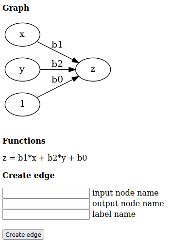

# TeSoPs flowchart graphviz

Prototype of a flowchart to formula convertor for the project TeSoPs,
implemented with the Python library graphviz

## Usage instructions

```bash
git clone https://github.com/ESI-FAR/tesops-flowchart-graphviz.git
cd tesops-flowchart-graphviz
pip install -r requirements.txt
python3 -u www/app.py
```

Then access the app by pointing your web browser to: http://localhost:8000/
and build a graph by creating edges. The mathematical functions representing
the graph will be shown under it.

## Screendump


